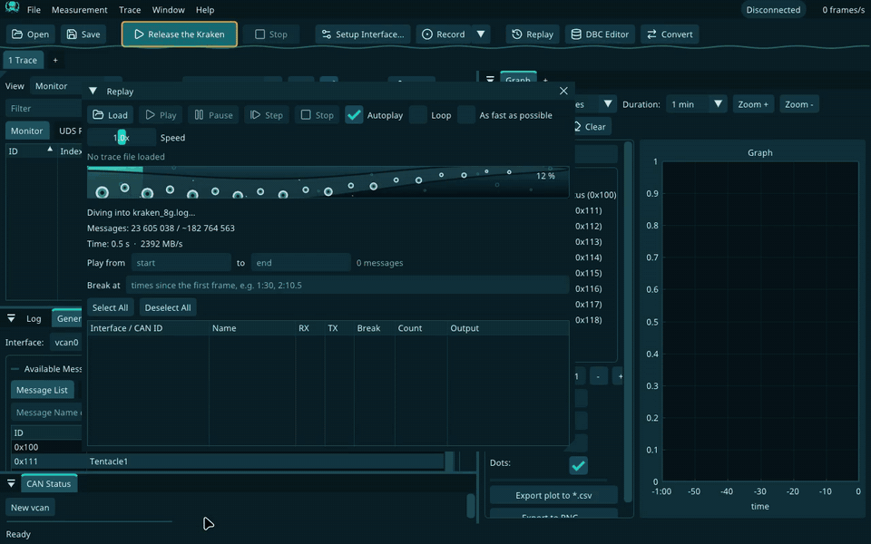

#  Kraken Explorer: Day of the N2K Tentacle

_"Deeper than a Peak. Wireshark is stuck in shallow waters."_

Open-source CAN / CAN FD / LIN / NMEA 2000 bus analyzer for Linux and Windows. Dear ImGui GUI in a
deep-sea dark theme, GPL-2.0, fork of [CANgaroo](https://github.com/Schildkroet/CANgaroo).

[](docs/demo.mp4)

▶ [Demo video (1:36)](docs/demo.mp4): an 8 GB log (183 million frames) opens in 4 s, then the file
in the trace, the Ctrl+P signal finder, Value Search, replay with breakpoints and Step, and live
DBC-decoded traffic on `vcan0`.

## Download

Release [0.0.4](https://github.com/stoffej/kraken-explorer/releases/tag/0.0.4)
([all releases](https://github.com/stoffej/kraken-explorer/releases)):

| Platform | Package |
|---|---|
| Ubuntu / Debian | [kraken-explorer_0.0.4_amd64.deb](https://github.com/stoffej/kraken-explorer/releases/download/0.0.4/kraken-explorer_0.0.4_amd64.deb) |
| Linux, no install | [Kraken_Explorer-0.0.4-x86_64.AppImage](https://github.com/stoffej/kraken-explorer/releases/download/0.0.4/Kraken_Explorer-0.0.4-x86_64.AppImage) |
| Windows installer | [kraken-explorer-0.0.4-win64-setup.exe](https://github.com/stoffej/kraken-explorer/releases/download/0.0.4/kraken-explorer-0.0.4-win64-setup.exe) |
| Windows portable | [kraken-explorer-0.0.4-win64.zip](https://github.com/stoffej/kraken-explorer/releases/download/0.0.4/kraken-explorer-0.0.4-win64.zip) |

```bash
curl -fsSL https://raw.githubusercontent.com/stoffej/kraken-explorer/main/scripts/get.sh | sh   # Ubuntu / Debian: latest .deb + netdev group
sudo apt install ./kraken-explorer_0.0.4_amd64.deb   # or by hand; icon, menu entry and SocketCAN polkit rule included
chmod +x Kraken_Explorer-0.0.4-x86_64.AppImage && ./Kraken_Explorer-0.0.4-x86_64.AppImage
```

### Code signing policy

Free code signing provided by [SignPath.io](https://signpath.io), certificate by
[SignPath Foundation](https://signpath.org). The Windows exe and installer are signed by SignPath
from builds of this repository's CI.

* Committers and reviewers: [the repository owner](https://github.com/stoffej)
* Approvers: [the repository owner](https://github.com/stoffej)
* Privacy policy: this program will not transfer any information to other networked systems
  unless specifically requested by the user or the person installing or operating it. The REST
  API (`--api PORT`) listens on 127.0.0.1 only and only when started with that flag.

## Build from source

One-liner (installs build dependencies, builds a `.deb` and installs it):

```bash
git clone https://github.com/stoffej/kraken-explorer && cd kraken-explorer && scripts/install.sh
```

By hand:

```bash
cmake -S . -B build -G Ninja && cmake --build build --target kraken-explorer
build/src/kraken-explorer                       # run in place, or:
scripts/build_deb.sh && sudo dpkg -i build/deb/kraken-explorer_*.deb
```

Running the binary without the `.deb`? SocketCAN link control needs the polkit rule, one line to install (log out and back in once for the group; re-run the `cp` after pulling, the rule only matches the `ip link` command lines of the matching build):

```bash
sudo cp packaging/10-kraken-explorer-socketcan.rules /usr/share/polkit-1/rules.d/ && sudo usermod -aG netdev $USER
```

Interfaces, features, dependencies and permissions: [docs/manual.md](docs/manual.md).
